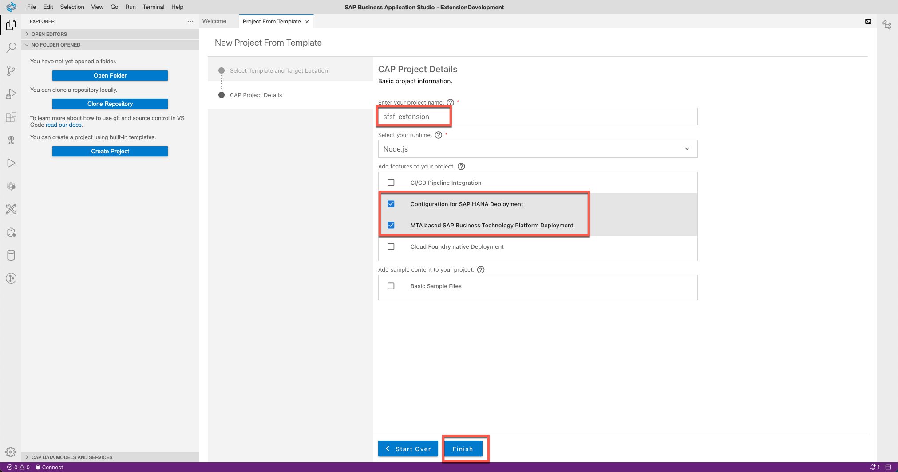

##  1 - Configure SAP Business Application Studio for development

The SAP Business Application Studio is a development environment available on SAP Business Technology Platform. You will use the development environment to build the extension application.

---
1.1. Navigate to **Security>Users** inside your trial subaccount. Select your user and click on **"Assign Role Collection"** 


1.1. Select the roles **Business_Application_Studio_Administrator** and **Business_Application_Studio_Developer** and assign to your user. 


   
1.3. Navigate to **Instances and Subscriptions** inside your trial subaccount. Find **"SAP Business Application Studio"** within Application Subscriptions and launch it either from launch icon or "..." --> "Go to Application"
   

   
1.4. **Create** a new development Space. 
   

    
1.5. Give the new dev space (e.g. ExtenstionDevelopment) and select the following extensions to enable them in the development space:
* Full Stack Cloud Applciation

   

1.6 You can find the newly defined and preconfigured development space with all required tools in the overview of your development spaces. Open the Space for Development 
   
   


##  2 - Getting Started with Extension development


2.1. Once the Business Application Studio has been started, create a new project from template **Start from Template**


2.2. Choose **CAP Project** as a Template


2.3. Give a name to project e.g. **sfsf-extension**, keep the Node.js runtime and add *Configure for SAP HANA Deployment* and *MTA based SAP Business Technology Platform Deployment* features to your project.



2.4. Project will be opened in a new workspace where you can start the development. Get familar with the project structure.
Generated project has this default layout:

* app/	UI content goes in here; one or more in subfolders
* db/	Domain Models and database-related content go in here
* srv/	Service definitions and implementations go in here
* package.json	your project descriptor

For more information about Cloud Application Programming check following [documentation](https://cap.cloud.sap/)


2.5. Create new Data Model in db folder. Create new file db folder **db/schema.cds** and add following content.

````js
using { managed, sap } from '@sap/cds/common';
namespace sap.capire.senioritycalc;

entity Employee : managed {
    key ID : UUID;
    userId : String(64);
    hireDate : Date;
    terminationDate : Date;
    originalStartDate: Date;
    status : String(1024);
    seniority: DecimalFloat;
}
````

2.6 Define Services. Create 2 new files in srv folder **srv/emp-service.cds** and **srv/emp-service.js** . Add following content.

**srv/emp-service.cds**
````js
using {sap.capire.senioritycalc as my} from '../db/schema';
using ECEmploymentInformation from './external/ECEmploymentInformation.csn';

service EmployeeService @(requires : 'authenticated-user') {

    // Expose external SFSF API for demo purpose
    entity Employee      as projection on my.Employee;

    // Simulate events for local test
    action simulateEvent(userId : String, hireDate : String, terminationDate : String, originalStartDate : String, status : String);

    entity EmpEmployment as projection on ECEmploymentInformation.EmpEmployment {
        userId,
        startDate,
        originalStartDate
    };

    event EmployeeEvent {
        userId            : String;
        hireDate          : String;
        terminationDate   : String;
        originalStartDate : String;
        status            : String;
    }
}

````

**srv/emp-service.js**
````js
module.exports = async srv => {

    const messaging = await cds.connect.to('messaging');
    const sfemp = await cds.connect.to('ECEmploymentInformation');

    const { Employee, EmpEmployment } = srv.entities

    // Using EmpEmployment API
    srv.on('READ', EmpEmployment, async (req) => {
        try {
            return sfemp.run(req.query);
        } catch (err) {
            req.reject(err);
        }
    });

    // Simulate Event to test locally
    srv.on('simulateEvent', async req => {
        try {
            await messaging.tx(req).emit('sap/successfactors/SFPART064985/isc/contractchange',  req.data );
            return {};
        } catch (err) {
            console.error(err);
            return {};
        }
    });


    messaging.on('sap/successfactors/SFPART064985/isc/contractchange', async (msg) => {
        console.log("<< create event caught", msg);
        try {
            let employee = msg.data
            let id = employee.userId
            let { years, months, days, totalDays } = await calcSeniorityTotalDays(employee)
            console.log(totalDays);
            return {}
        } catch (err) {
            console.error(err);
        }
        
    });

    const calcSeniorityTotalDays = async (employee) => {

        const status = employee.status;
        Object.keys(employee).forEach(key => {
            if (employee[key] === '') {
                employee[key] = null;
            }
        });

        // START SENIORITY RULES

        let hireDate = new Date(employee.hireDate)
        let terminationDate = new Date(employee.terminationDate)
        let originalStartDate = new Date(employee.originalStartDate)
        let diffInMs = null;

        if (status.includes("HIR", 0)) {
            diffInMs = Date.now() - hireDate;
        }
        else if (status.includes("TER", 0)) {
            diffInMs = Math.abs(terminationDate - originalStartDate);
        }
        else if (status.includes("RE", 0)) {
            let history = await srv.run(SELECT.one.from(Employee).where({ userId: employee.userId, status: { like: '%TER%' } }).orderBy('terminationDate desc'));
            if (history != null && history.terminationDate != null) {
                terminationDate = new Date(history.terminationDate)
                diffInMs = Math.abs(hireDate - terminationDate);
                diffInMs = diffInMs > 180 * (1000 * 60 * 60 * 24) ? Date.now() - hireDate : Math.abs(terminationDate - originalStartDate) + Math.abs(Date.now() - hireDate);
            }
        }

        let diffInDays = Math.round(diffInMs / (1000 * 60 * 60 * 24));
        let years = Math.floor(diffInDays / 365.25);
        let months = Math.floor(diffInDays % 365.25 / 30);
        let days = Math.floor(diffInDays % 365.25 % 30);

        // END SENIORITY RULES
        employee.seniority = diffInDays
        srv.run(INSERT.into(Employee).entries(employee));

        return { years: years, months: months, days: days, totalDays: diffInDays };
    }

    const getSeniorityPayload = (userId, years, months, days, totalDays) => {
        return {
            "__metadata": {
                "uri": `https://apisalesdemo4.successfactors.com:443/odata/v2/EmpEmployment(personIdExternal='${userId}',userId='${userId}')`,
                "type": "SFOData.EmpEmployment"
            },
            "customString1": years.toString(),
            "customString2": months.toString(),
            "customString3": days.toString(),
            "customString4": totalDays.toString()
        }
    }
}

````

2.7. Explore **SAP SuccessFactors** APIs in [SAP API Hub](https://api.sap.com/) by checking the [SuccessFactors APIs](https://api.sap.com/products/SAPSuccessFactors/apis/all).

For this scenario we are interested in API to access the employment related information. This you can find by looking in SAP SuccessFactors Employee Central > [Employment Information](https://api.sap.com/api/ECEmploymentInformation/overview)

2.8. Open the [Employment Information](https://api.sap.com/api/ECEmploymentInformation/overview) from SAP SuccessFactors Employee Central and download **EDMX** API Specification which will be used in our application


2.9. Import the downloaded API Specification into your project root folder


2.10. To use a Service API for a Remote Service (SAP SuccessFactors), import the API to your project using **cds import**. Open new Terminal Window and execute following cds command


````bash
 cds import ECEmploymentInformation.edmx 
````


2.11. Open your project descriptor **package.json** and replace it by using following snipped

````json
{
  "name": "eu-demo",
  "version": "1.0.0",
  "description": "A simple CAP project.",
  "repository": "<Add your repository here>",
  "license": "UNLICENSED",
  "private": true,
  "dependencies": {
    "@sap/cds": "^5",
    "express": "^4",
    "hdb": "^0.18.3"
  },
  "devDependencies": {
    "@sap/ux-specification": "^1.100.1",
    "sqlite3": "^5.0.2"
  },
  "sapux": [
    "app/fiori",
    "app/fiori",
    "app/fiori"
  ],
  "scripts": {
    "start": "cds run",
    "undeploy": "cf undeploy eu-demo --delete-services --delete-service-keys"
  },
  "eslintConfig": {
    "extends": "eslint:recommended",
    "env": {
      "es2020": true,
      "node": true,
      "jest": true,
      "mocha": true
    },
    "globals": {
      "SELECT": true,
      "INSERT": true,
      "UPDATE": true,
      "DELETE": true,
      "CREATE": true,
      "DROP": true,
      "CDL": true,
      "CQL": true,
      "CXL": true,
      "cds": true
    },
    "rules": {
      "no-console": "off",
      "require-atomic-updates": "off"
    }
  },
  "cds": {
    "requires": {
      "uaa": {
        "kind": "xsuaa"
      },
      "auth": {
        "kind": "dummy-auth"
      },
      "messaging": {
        "kind": "enterprise-messaging-shared",
        "[production]": {
          "kind": "enterprise-messaging-shared"
        },
        "[development]": {
          "kind": "local-messaging"
        }
      },
      "db": {
        "[production]": {
          "kind": "hana"
        },
        "[development]": {
          "kind": "sql"
        }
      },
      "ECEmploymentInformation": {
        "kind": "odata-v2",
        "model": "srv/external/ECEmploymentInformation",
        "[production]": {
          "credentials": {
            "destination": "apihub_sandbox",
            "path": "/odata/v2"
          }
        },
        "[development]": {
          "credentials": {
            "url": "https://sandbox.api.sap.com/successfactors/odata/v2",
            "headers": {
              "APIKey": "<API key>"
            }
          }
        }
      }
    },
    "hana": {
      "deploy-format": "hdbtable"
    }
  }
}

````


2.12. Get the **API Key** from API Hub to use the sandbox system. Open https://api.sap.com/ and sign-in.


2.13. Click on you Users and go to **Settings** and press on **"Show API Key"**. Finnaly copy the key


2.14. Add the copied API Key to your project descriptor **package.json**


````json
...
        "[development]": {
          "credentials": {
            "url": "https://sandbox.api.sap.com/successfactors/odata/v2",
            "headers": {
              "APIKey": "<API key>"
            }
          }
        }
...
````


2.15. Install the dependencies using following command in terminal


````shell
 npm install
````

##  3 - Running and testing the Application in development enviroment


3.1. Start your project localy using **cds** cli


````zsh
 cds watch
````


